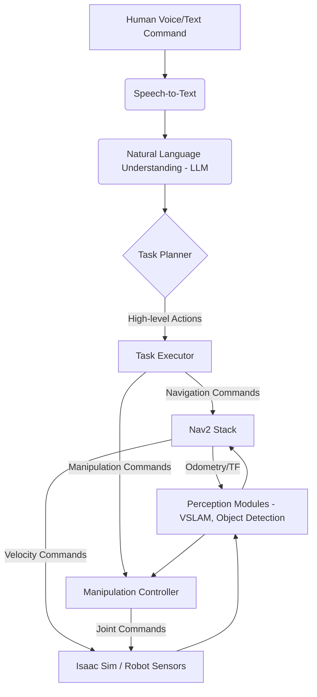

# Capstone Project: Autonomous Humanoid

This Capstone Project brings together all the knowledge and skills you've acquired throughout the textbook. Your goal is to develop a simulated autonomous humanoid robot capable of understanding high-level natural language commands, perceiving its environment, navigating to targets, identifying objects, and performing basic manipulation tasks.

---

:::info Hybrid Guidance
This capstone provides high-level goals and architectural suggestions, but leaves much of the specific implementation details to you. You are encouraged to apply creativity and problem-solving skills to integrate the concepts learned in previous modules.
:::

---

## Project Goal

Develop a VLA (Vision-Language-Action) system for a simulated humanoid robot that can:

1.  **Understand Natural Language Commands**: Translate spoken or typed high-level instructions (e.g., "Go to the red table and pick up the blue cube") into a sequence of robot actions.
2.  **Perceive the Environment**: Use simulated sensors (camera, depth, LiDAR) to build a map, localize itself, and identify objects.
3.  **Navigate Autonomously**: Plan and execute collision-free paths in a dynamic simulated environment, adapting to unexpected obstacles.
4.  **Perform Basic Manipulation**: Approach and interact with identified objects (e.g., "pick up," "place down").

## Key Milestones

The project can be broken down into the following key milestones:

### Milestone 1: Environment Setup and Robot Integration

-   **Objective**: Get your chosen humanoid robot model (or a sufficiently articulated model) working in NVIDIA Isaac Sim.
-   **Tasks**:
    -   Import your humanoid URDF into Isaac Sim.
    -   Set up a basic simulated environment (e.g., a room with a few simple objects: a table, a cube, a sphere).
    -   Ensure your robot has a camera and/or depth sensor configured and publishing ROS 2 topics.
    -   Verify the robot can be controlled (e.g., basic locomotion commands or joint control) via ROS 2 topics from an external node.

### Milestone 2: Perception and Mapping

-   **Objective**: Enable your humanoid robot to understand its surroundings.
-   **Tasks**:
    -   Implement a VSLAM pipeline (using Isaac ROS Visual SLAM or an alternative) to build a map of your simulated environment.
    -   Integrate `robot_localization` or a similar package to fuse odometry and IMU data for robust state estimation.
    -   Implement basic object detection (e.g., using a pre-trained YOLO model or a simple color detection) to identify key objects in your environment (e.g., "red cube," "blue sphere").

### Milestone 3: Autonomous Navigation

-   **Objective**: Make your humanoid robot capable of moving to specified locations.
-   **Tasks**:
    -   Configure the Nav2 stack for your humanoid robot. This will require careful tuning of local and global planners, and potentially a custom controller for bipedal gait (or a simplified base controller if your humanoid has a mobile base).
    -   Load your generated map into Nav2.
    -   Test sending navigation goals to your robot using RViz2.
    -   Ensure the robot can navigate to a target location without collisions.

### Milestone 4: Language Understanding and Action Planning

-   **Objective**: Translate natural language commands into robot actions.
-   **Tasks**:
    -   Integrate a Speech-to-Text (STT) service (e.g., OpenAI Whisper API, or a local STT engine) to convert spoken commands into text.
    -   Develop a Natural Language Understanding (NLU) module:
        -   Use an LLM (e.g., GPT-3.5/4 via API, or a smaller local model) to parse the text command and extract intent (e.g., "pick up," "go to") and relevant entities (e.g., "red cube," "table").
        -   Translate these intents and entities into a sequence of high-level robot actions (e.g., `navigate_to(object)`, `grasp(object)`).
    -   Create a "Task Executor" node that translates these high-level actions into calls to your ROS 2 navigation and manipulation nodes.

### Milestone 5: Basic Manipulation

-   **Objective**: Enable the humanoid to interact with objects.
-   **Tasks**:
    -   Integrate your robot's arm and gripper (if present) with ROS 2 (e.g., using MoveIt or direct joint control).
    -   Implement a simple grasping primitive: Given an object's pose from your object detection, move the robot's arm to approach and "grasp" the object (in simulation, this might involve simply attaching the object to the end-effector).
    -   Test the manipulation system with simple commands (e.g., "pick up the cube").

## Architectural Suggestions

Consider a modular ROS 2 architecture for your VLA system:

> 

## Sample Natural Language Commands

Test your system with commands like:

-   "Robot, go to the blue sphere."
-   "Pick up the red cube."
-   "Navigate to the table."
-   "Find the green cylinder and put it on the table."

## Further Enhancements (Optional)

-   **Error Handling**: Implement robust error detection and recovery (e.g., "I couldn't find the red cube, please try again").
-   **Multi-modal Interaction**: Allow the user to point at objects in the simulation.
-   **More Complex Manipulation**: Develop finer-grained control for more dexterous tasks.
-   **Learning from Demonstration**: Allow the robot to learn new skills from human demonstrations.

Good luck with your Capstone Project!
